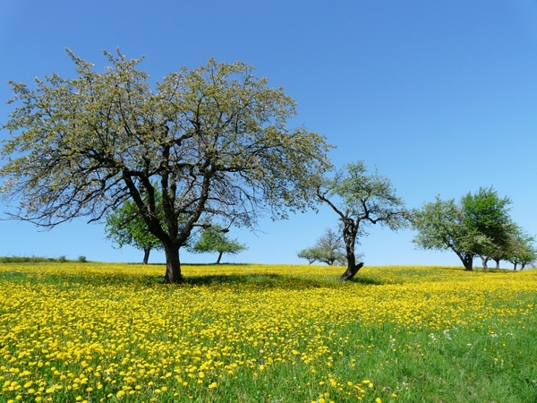
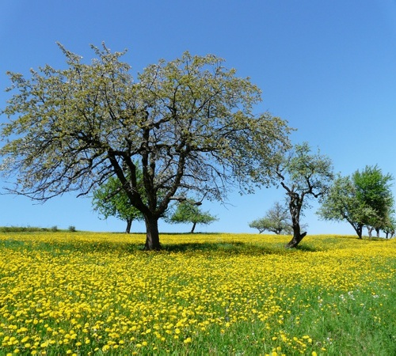
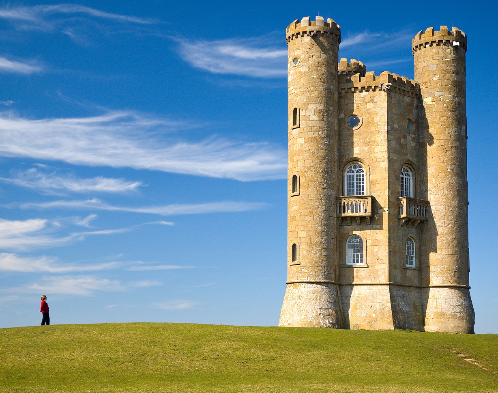
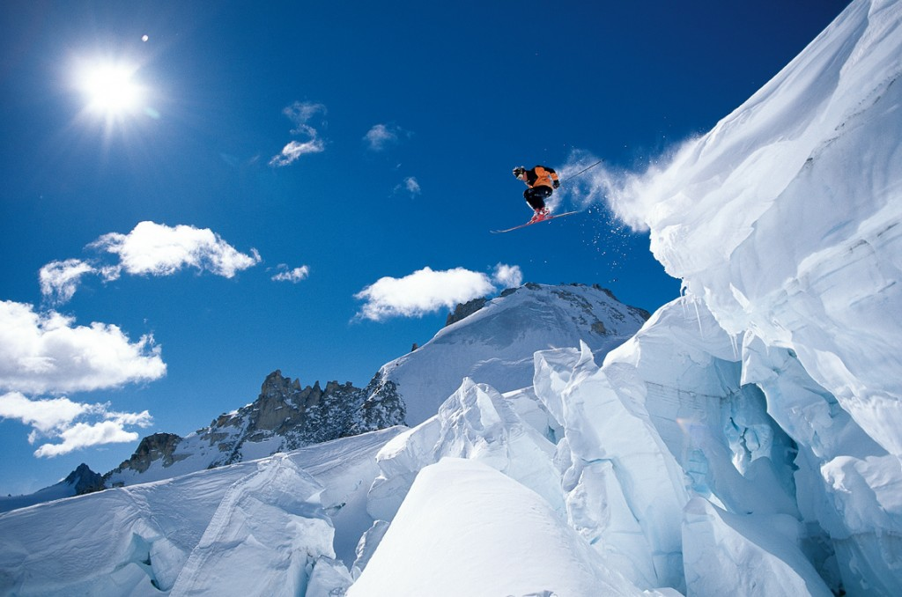
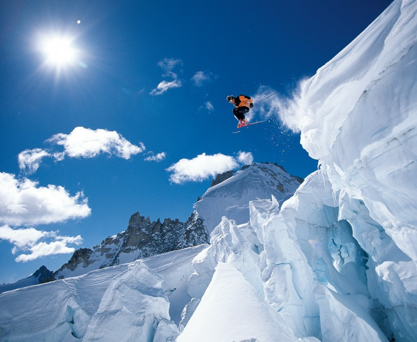

# Seam-Carving-Project

UPEC Master 1 - Python Project

## Installation

This project runs with python 3 and the following librairies :

* TKinter
* Numpy
* Open CV
* PIL

## Getting Started

To start the application, you just need to execute app.py located in the root directory.

```
python3 app.py
```

## Description

### Functionalities

This project implements two seam carving algorithms to reduce the width of an image. The user can directly draw on the image to indicate important areas to preserve them. Some parameters of the algorithm can also be adjusted dynamically to speed-up computations at the expense of accuracy.

### Algorithm

#### Seam energy algorithm

The algorithm is based on dynamic programming.
First, we create a table with the energy for each pixel, which is simply the gradient.

When we have all the energies, we choose, for each row and for each pixel, one of his three upper pixels with the lowest total energy. We repeat this operation until we reach the bottom of the image.

Now we just have to loop on the last row, take the pixel with the lowest total energy and climb the table to retrieve the seam path.

#### Local energy algorithm

There is another algorithm, that use the same approach with the energy of each pixel, but which choose the path differently.

Instead of looking at the total energy, it only looks at energy of the pixel. Despite that the path computed is not the minimal path, it's still a low energy path and in certain cases, the seam is smoother.

Overall, the seam energy based algorithm works better than the local energy based one.

### Examples

 

Here we have a first example with trees. We can see that the tree on the left is intact, the right one is shrinked but still looks normal.
However in the middle, the tree has one of his branches cut. 

 

This castle is the best and most trivial example for seam carving. The castle and the watcher on the left are nearly never touched. When we reduce the accuracy of the algorithm, we have few seams that cross the castle but it is unnoticeable.

 

Finally, a last example with a skier. The skier himself keeps a good shape, which is not the case for his skis. 
Because of the resolution and the snow below the skier, his skis are cut just in front of his feet. After several seams, we follow the same path and his skis are shifted under the skier.

### Observations

We can see in these examples that in certain cases, well in fact in most cases, the seam carving can produce some visual artefacts even in important areas for humans.

In fact it depends on the image, some algorithm works better than others but overall, when important areas are indicated, it works well.

We haven't talked about accuracy in these examples, the accuracy was set to the maximum. However this is not necessary, after testing, we can lower the accuracy while having a pretty good result and therefore reducing computations time.

## Author

CLAUDEL Arnaud